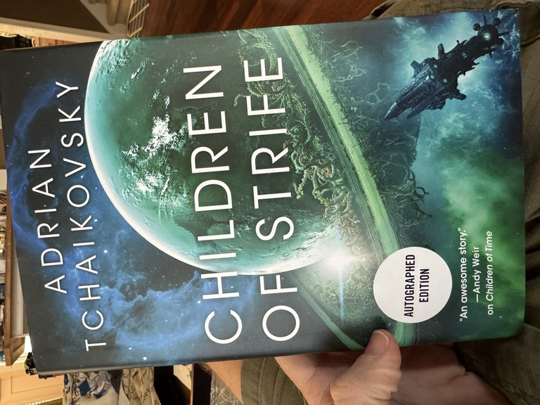
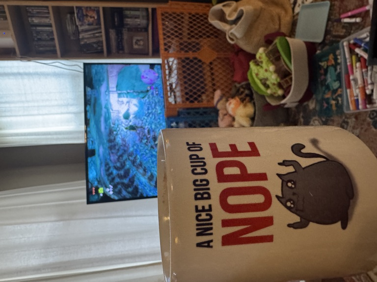
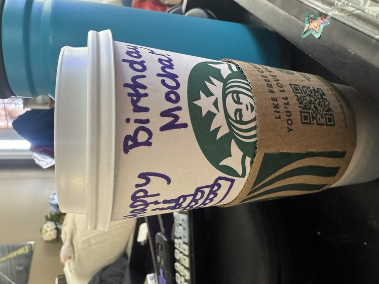

{.preview-image fig-alt="Adrian Tchaikovsky's newest book in the _Children of Time_ series, _Children of Strife_. Shows a hardcover book in the same style as the other books in the series, though the planet is a sickly green."}

I'm not an artist or a designer like [Giorgia Lupi](https://www.nytimes.com/interactive/2023/12/14/opinion/my-life-with-long-covid.html); I'm nowhere near the caliber of writer as [my wife](https://write2run.com/2026/02/20/the-power-of-curiosity/) or [Dr. Hicks](https://www.drcathicks.com/post/covid-data-log). But the more voices we have talking about their long COVID experiences, I can only hope, the sooner we'll have answers.

::: {.callout-warning}
## COVID, language

This post goes into detail about my experience with COVID. It's not graphic per se, but I don't mince words with the symptoms or with my feelings about society's reactions.

:::

In the six years (what the _fuuuuuck_) since COVID first emerged, I've contracted it twice---that I know of, at least.

## We picked it up from Arizona (Part 1)

### The Acute Phase

I tested positive around 10pm the evening of December 31, 2022. I would test positive for the next 9 days.

That first 24 hours were definitely the "acute" phase: the only reason I even thought to test at 10pm on New Year's Eve was because I'd felt increasingly shitty over the few hours beforehand. I'd literally tested _that morning_ and been negative, so yeah, that's how quickly it shifted.

For the next day, I ran a fever of about 101F: not high enough to be a serious fever, but high enough that I definitely felt crummy.

The week+ after that was annoying as shit: wearing a mask all the time inside the house, confining myself to our guest bedroom each night, and generally trying to take it easy while also co-parenting a 2-year old who didn't---couldn't---understand what was going on.

To this day I still can't explain why I turned down a prescription of Paxlovid. In my personal head canon, it's among the dumber decisions I've ever made, especially since I have absolutely no defense of or rationale for it. But for whatever reason, I turned it down. The acute symptoms weren't too bad, but I'll be forever left wondering if it may have eased the Long symptoms that were soon to appear.

### The Long Phase

Within a week after testing negative, I started running again. The first week was ok; my Garmin watch predictably estimated that my runs were very high-effort undertakings, but I expected that. I hadn't been consistent with running for years by this time---I logged just over 300 miles in each of 2021 and 2022, which amounts to barely 25-30 miles per month on average, or not even 1 mile per day---so I knew it'd be an uphill battle, literally and figuratively.

But within another month, I noticed something worrying: the first 20-30 minutes of my runs would feel like I was _drowning_.

I've never experienced a drowning sensation per se, but this felt how I would imagine it: like there was an elephant sitting on my chest, and despite heaving air in and out it made absolutely no difference. I'd have to stop and walk for a few minutes, wait for my breathing to even back out, then run again for maybe a quarter mile before again needing to walk. Wash, rinse, repeat for about the first 30 minutes of any run.

Also, this was when I noticed frequent---often, weekly---headaches that wouldn't respond to ibuprofen, or any OTC painkiller. At the time I chalked it up to burnout recovery, but by April of 2023 I'd learn: this was severe obstructive sleep apnea.

Two breathing issues that had never even been on my radar before, suddenly appearing and lingering for _months_ after a COVID infection? Not suspicious at all. It took a good six months before the starts of my runs began to feel easier, though in the three years since I still haven't returned to the "easy" paces I used to run pre-COVID.

I've also been in treatment for sleep apnea for six months now, and only since starting that treatment have those unresponsive headaches really begun to vanish: where I was averaging one headache about every 1-2 weeks, I've had maybe 2-3 of these headaches in all of 2026 so far.

Fucking thanks a ton, COVID.

## We picked it up from Arizona (Part... 2??)

In a broad statistical sense, it's not terribly weird that we'd get COVID while traveling, but it _is_ weird that, in having caught COVID twice, both happened on the same trip to the same place exactly three years apart.

Aside, but still relevant: we're not exactly jumping to go to Arizona over Christmas again for the forseeable future.

{fig-alt="The Oatmeal's fantastic stylized mug showing a cartoon cat flipping off the viewer, with text reading 'A nice big cup of NOPE'."}

### The Acute Phase

The 2022 round of COVID, while (spoiler alert) far more damaging, was at least predictable: we know where we got it from, and its timetables made sense.

By contrast in every possible way, I have _no fucking clue_ where we picked up the December 2025 variant.

 - The airport? Then why didn't ANY of the LITERALLY DOZENS of family members we spent DAYS with pick it up, too? Or any of the FIVE other people we shared an Airbnb with?).
 - I have no idea how Cathryn then got it from me (I was masking up everywhere the _second_ I tested positive; we had three HEPA filters running the house; I self-quarantined in the guest room).
 - I will never understand how or why Z was spared COVID not once but _twice_ but I will be forever grateful for that small but critical mercy.

The positive test was a fucking _shock_; I felt perfectly fine. I'd tested negative two days before, and this was just another cursory test before leaving town. I felt fine the rest of the day as we traveled home (I know, I know; I kept my mask on at _all_ times, not even removing it to eat or drink, or even in the 90-minute car ride home from the airport).

But through the whole trip back home, I felt perfectly fine. The only hiccup was in the middle of the night, once we were back home: I woke up at about 3am and felt chilled, like I couldn't quite warm up despite wearing a hoodie and sweat pants. I ate some food, took some ibuprofen, passed back out, and woke up at 8am feeling perfectly fine again. No other symptoms whatsoever; not even a runny nose. My temperature was normal.

Taking a lesson from 2022 to heart, I got myself a Paxlovid script. That medication doesn't fuck around: yeah, you definitely get that metallic taste in your mouth, but holy wow it punched COVID right in its ugly fucking face. By the end of the 5-day regimen, I tested negative. To be absolutely sure it was gone, I kept testing for another 5 days, but never got a rebound. Cathryn tested negative before she even finished her Paxlovid regimen, and just like that we'd ditched COVID for a second time.

### The Long? Phase

Knock on wood, but so far, I haven't felt any ill respiratory effects. No feeling like I'm drowning on runs.

There is one random item: my left bicep is perpetually sore. I recall, in that first week after I tested positive, lifting Z with that arm while we were playing a game. It was one of the (very) few times I exerted myself in any meaningful capacity---it should surprise exactly no one at this point in time that I take COVID and recovery seriously---and of course I didn't think anything of it at the time. But once I tested negative and started lifting and running activities again, I noticed that my left bicep required warming up to an extent that it hadn't previously; if I went in an curled a dumbbell immediately, it *burned* painfully. And that feeling has stuck around for over a month now: just this morning I lifted Z to sit on my lap, and winced and ground my teeth at the shot of pain in my left bicep.

I recall from the first round of COVID that some bizarre muscular soreness would stick around for *months* after I'd recovered. I feel like this could be that, again. But if that's all it left me with this time around, I'll gladly add it to the pile of creaks and groans I've been accumulating since turning 40.

## What now?

I had a recent meeting with my dietician, and the first thing she said when I walked in and said hello, was: "You're not sick! Sorry, it seems like every patient of mine lately has had some respiratory disease or other, and coughs up a lung over the course of our appointment, always without a mask."

Just because we're returning to a pre-pandemic sense of normalcy, doesn't mean we have to go back to doing everything *exactly* the way we did it before, y'all. I, for one, will personally *never* go back to not masking up at airports and on airplanes; even before the pandemic, it was practically a guarantee I'd come back from a plane trip with *some* kind of respiratory pathogen.

For the past couple years, I've been getting the COVID jab twice a year: once as soon as the new version comes out (September-October ish), and another six months later right around my birthday. I'm convinced that twice/year jab for a couple years was the reason my symptoms the second time around were so mild-to-nonexistent.

It's also ok to stay home when you're sick. Or, at the very *fucking* least, to wear a *fucking* mask. Public health isn't public because we say it is; it's public because that's how a mutually beneficial civilization fucking works, your actually-cowardly "I'm not going to live in fear" vapid platitudes be damned.

This gets to [the sense of "moral injury"](https://www.scientificamerican.com/article/moral-injury-is-an-invisible-epidemic-that-affects-millions/) that some have talked about since the pandemic: the feeling that folks' peers and support groups abandoned, or even betrayed, them during the pandemic and since, putting their own convenience above the well-being of others. It's a [well-studied phenomenon, and while it's most acutely felt in the public health and healthcare sectors](https://pmc.ncbi.nlm.nih.gov/articles/PMC8900218/)---for good reason---it's certainly not limited to those.

Much like with other "purely political" differences^["Politics" is how we put our values into action. Nothing more, and nothing less.], there are folks I've stopped following and cut ties with over their COVID actions. I never would have considered myself "high risk" for COVID complications, but then again, *a lot* of people dealing with chronic COVID issues right now hadn't considered themselves at risk until, well, they were.

That's the way *most* things in this world are: you're fine, until you're not. Don't make the mistake of thinking yourself so morally superior that it can't happen to you.

On the other hand, I've had existing friendships deepen considerably over COVID and its fallout. There are some people who went from very occasional acquaintences to some of my best friends in this fragile world because of our jointly held belief that we're all stronger and better off when we work together.

It's the latter I'm going to keep investing in. After all, they invested in me and my family when they wore a mask to the airport.

Meanwhile, I'm still running, still lifting, and still kicking ass at work. And just trying to keep up with Z 😅

{fig-alt="A Starbucks mocha marked up with 'happy birthday' messages."}