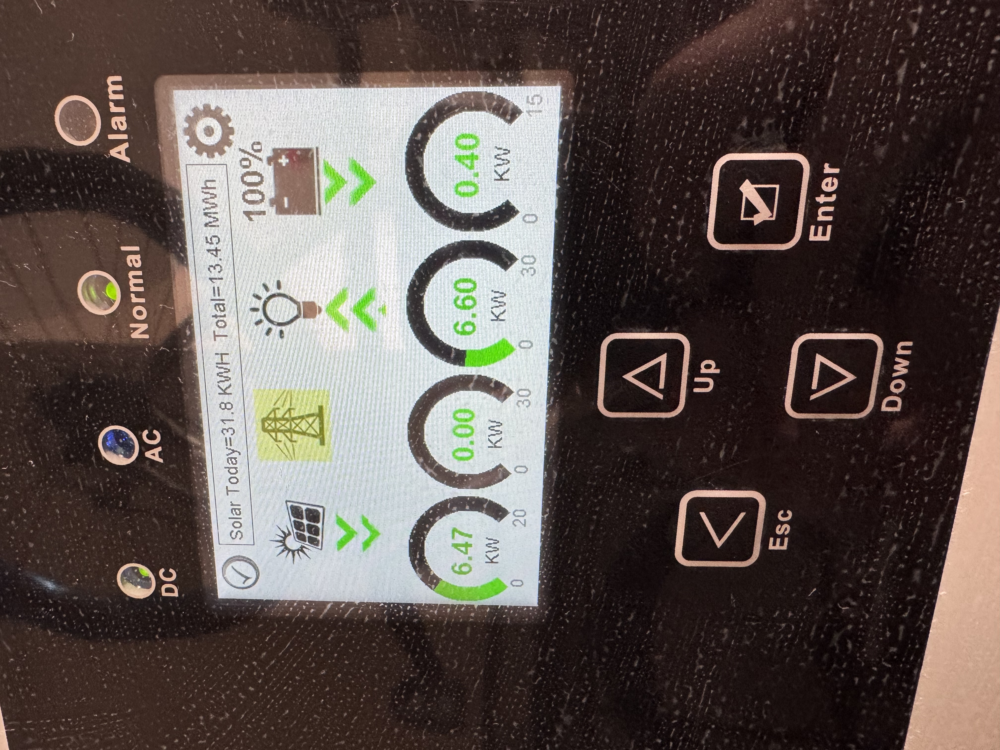
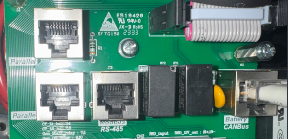
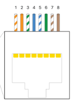
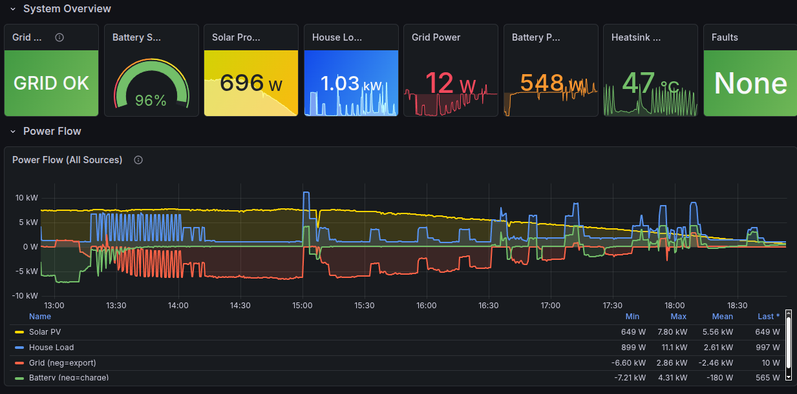
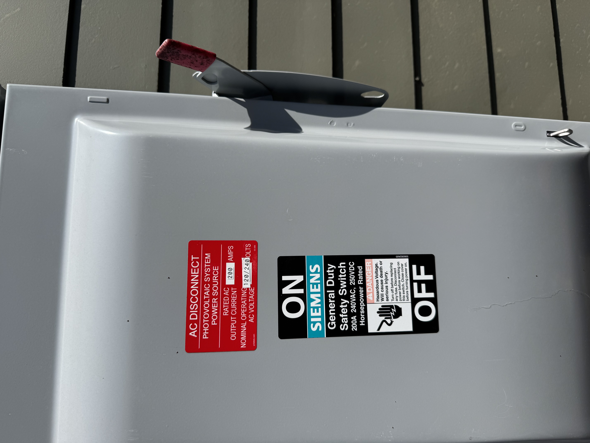

{.preview-image fig-alt="A picture of the front monitor panel of my Sol-Ark inverter, showing a graphical representation of the basic real-time values it monitors and maintains: incoming grid power, solar generation, battery charge levels, and outgoing grid electricity."}

A few weeks ago I had a Doctor Frankenstein "IT'S ALIIIIIIIIVE" moment when a Raspberry Pi I'd hard-wired to a bizarre USB-to-RJ45 converter and plugged directly into my five-figure solar inverter to facilitate communication over a byzantine and mostly undocumented modbus protocol *started returning actual numbers* that coincided with reality. I'd spent the first few months of 2026 diving headfirst with reckless, healing-from-burnout abandon into this task with little to show for it, until now.

So now I'm sharing it. This is for the folks on [the DIY Solar Forum thread I started](https://diysolarforum.com/threads/custom-monitoring-on-sol-ark-15k-lv.121906/) which is, essentially, the impetus of this blog post.

If you don't want to read the "background lore" and just want the recipe, feel free to [skip to the section below titled "The Setup"](#the-setup).

## The Background

### Brace yourselves: winter is coming

It began with the early January 2026 winter storms.

A few days ahead of the storms' arrival, weather forecasters were already warning that not only was ice likely, but was increasingly looking like it would break records. Athens was forecast for an _inch_ of icing overnight, with predicted power outages across the stage implying a restoration time on the order of _days_, rather than hours.

tl;dr buckle up, kids.

In my mind, this would have been the first real test of our year-old solar + battery setup. After having it installed in late 2024 and fully brought online in early 2025, there hadn't been any serious winter weather (or any serious power outages to speak of, aside from an odd 2-3 hour outage here and there).

Consequently, this was the first time I really sat down to consider: how long _could_ our setup sustain us in a truly off-grid scenario? If the grid failed in sub-freezing temperatures, how long could we reasonably expect to live off the batteries and whatever we collected via solar? Over the prior year I'd sketched out a rough diagram of some of our major appliances and how much power they seemed to draw based on our overall usage, but all this came from Sol-Ark's own cloud-based monitoring system: all qualitative graphs with variable axes and no hard spreadsheets, so I was eyeballing power usage at best.

To answer these questions, I had to do some digging. In the days ahead of this encroaching winter storm, I started going through the house, looking up old manuals online for the various appliances, and even crawling through our attic space to snap pictures of technical specifications on our HVAC to cross-reference online. Not to mention dusting off my high school electrostatics to calculate just how long we could operate under full battery charge.

### Our equipment

We've got a 15kWh inverter, which means that we can continuously push through 15kWh of electricity; and, if a temporary situation called for it, even slightly more than that, though this situation was tenuous: the inverter would shut itself down to prevent damaging itself or the house if it pushed anything beyond 15kWh for any kind of sustained period. So as long as our home never drew more than 15kWh at any given instant, I didn't have to worry about our inverter shutting down and, therefore, dowsing the rest of the house regardless of how much charge was still in the batteries.

Nothing in our house draws any kind of load even close to 15kWh on its own... *except for our heater*. So I went up into our attic space and found the HVAC specifications: 12kWh and change.

This was a relief, but not entirely. It meant that if we had _additional_ appliances running in excess of 3kWh at the time our heater kicked on, it could still induce an emergency shutdown of our inverter.

### My own "clean slate protocol"

I spent a couple of hours going around the house, identifying our various electronics and dependencies, and outlining a phased shutdown plan if the grid failed or was in imminent danger of failing. After a few more hours, the plan I designed would follow three steps: 

 1. The first would shut down various nonessentials (Nintendo Switch, outdoor holiday lights, Chromecast, external monitor and speakers, redundant wireless APs);
 2. The second would shut down our internet modem and various networking switches (leaving e.g. our home JellyFin server still running);
 3. The third and final would see _everything_ shut down and our thermostat dropped from its default of 65F to about 55F.

This protocol in place, I felt confident at least that we could avoid the catastrophic situation of our inverter performing an emergency shutdown while we still had full batteries.

But this didn't eliminate the problem of our heater singlehandedly draining our batteries all by itself.

### Monitoring and notification

As I said, I looked up the specifications for both our HVAC system and our twin EG4 batteries. Sketching some rough math, I found that---assuming minimal power draw elsewhere---our batteries could sustain our heater at full tilt for absolutely no longer than **2.5 hours**.

During waking hours, this isn't a problem: we notice the grid fails, we go around shutting everything down, including the heater (or at least, dropping the thermostat). The problem is if we're all asleep when the power fails.

And that was indeed a _problem_: all the weather forecasts pinpointed the peak of our ice storm at 3am. Which meant: in the space of the time we were all sound asleep, 1) the ice storm would arrive and reach its zenith, 2) the power would go out, 3) our batteries would kick on, and 4) they would drain completely while powering our heater, all because it was cold enough outside that our heater would run continuously to maintain the internal temperature.

Obviously we could drop the temperature in the house, and we certainly did, but remember: **we live in the southeast US.** Our houses are designed to _vent_ heat, not store it! When temperatures drop below freezing, it's genuinely difficult to keep our homes warm. 

## The Setup

Alright alright, enough pontificating: let's get to the setup.

### Hardware

Before I get to the process, I'll cut to the chase and give you the final list of equipment I used (because this took some trial-and-error):

 1. Raspberry Pi 4B, 2GB memory^[This is _massively_ overpowered for what it needs to do: ping the inverter on regular intervals, read the updates, and send them over WiFi to a custom receiver that actually compiles them. You need some kind of programmable node here, but I bet a Pi Zero, Pi 3B, or even earlier than that would work.]
 2. Cat6 ethernet cable, maybe 3-5ft^[It needs to be long enough to handle however many false starts you require for the custom wiring while still being able to reach from the Pi to the inverter; for me, this required about a foot, lol] (Cat5 should also work _in theory_)
 3. This [DSD TECH SH-U11F USB-to-RS485 converter](https://www.amazon.com/DSD-TECH-SH-U11F-Industrial-Application/dp/B083XSG1RG/)^[I'll go into this in more detail, but for my setup, this proved to be the lynchpin item.]

One optional piece of equipment that vastly improved my life: a [ferrule crimping kit with self-adjusting pliers](https://www.amazon.com/dp/B0CM3K91KK?ref=ppx_yo2ov_dt_b_fed_asin_title). This made it *substantially* easier to get the wires from the Cat6 cable into the USB-to-RS485 converter. The self-adjusting pliers will also work as wire cutters, though you may need some wire *strippers*.

### Software

I wrote the monitoring software in Python; I'm happy to post it somewhere if anyone cares enough. But the crucial package to make this work is [pymodbus](https://pymodbus.readthedocs.io/en/latest/).

The other critical piece of software that I used to do some minor reverse-engineering of the modbus protocol the inverter uses was [modpoll](https://www.modbusdriver.com/modpoll.html)^[You don't need modpoll for monitoring, but this was insanely useful for figuring out *how* to monitor the signals from the inverter in the Python script.].

Anyway, if there's interest in me open sourcing the monitoring software, let me know!

## The Hookup

The hookup was basically two distinct steps: the first was the **cabling** (getting the actual wires and components connected), and the second was **testing** (running tests on the Raspberry Pi to determine everything was working).



### Cabling

::: {.callout-note}

This step requires some comfort with low-voltage wiring. No soldering necessary, but wire stripping at a minimum. Either electrical tape or ferrules is also strongly recommended.

:::

This part had the fewest possible failure modes---I mean, it either works or it doesn't, lol---but undeniably took me the longest. Here's the short version of my iterations:

**First**, I started with the [Waveshare USB to RS485 bidirectional converter](https://www.waveshare.com/usb-to-rs485.htm). I also started by using the wiring diagram on the SolarAssistant guide, the [one specifying pins 1 and 2](https://solar-assistant.io/help/inverters/sol-ark/5K-1P-N/2-in-1-bms-port) as the ones to hook into the converter.

Now, it's entirely possible I got this wiring _wrong_ somehow, but: I could never get this setup to work. Of course, first I actually didn't wire up GND, amusingly thinking it didn't matter; everything I've read since says that GND matters _a LOT_, so make sure the converter has three wires in it.

Second, you'll need to chop off one end of your RJ45/cat6 ethernet cable, then strip the outer covering back to reveal all the twisted wire pairs (there should be 8 of them).



You only need to concern yourself with *three* of these eight wires: the SOLID GREEN one (that's your GND!), and then EITHER:

 - the STRIPED ORANGE and the SOLID ORANGE (this is the configuration outlined in the SolarAssistant docs, and which I tried first), or
 - the STRIPED BROWN and the SOLID BROWN (this is the configuration I went with)

Here's where you really need some steady hands, and some decent wire strippers: of the three small wires you're interested in, you'll need to strip off about an inch of their covers, exposing the bare metal wires.

This is why I ended up going with ferrule crimpers: you can "cap" these tiny wires with metal, then crimp them on so they form a really tight seal and are much easier to make contact with the metal leads in the converter. Again, I've no idea if I just couldn't get the bare wires connected properly, but it worked the very first time I threw on ferrules.

Anyway, in addition to going with wires 7 and 8, I also [switched to this converter](https://www.amazon.com/DSD-TECH-SH-U11F-Industrial-Application/dp/B083XSG1RG/). A recurring theme I'd found in researching this particular strategy was that connection to the inverter seemed to be very sensitive to ANY sources of noise--hence the importance of a properly-connected GND, _and_ repeated mention of a 120-ohm resistor in the path of the connection, which the above-linked converter [has built-in](https://github.com/pbix/HA-solark-PV?tab=readme-ov-file#connection-via-modbus-tcp-to-the-solark-inverter).

Between these minor but potentially critical changes, I was able to establish a working connection between the inverter and my Raspberry Pi. How did I know the connection was working? Read on!...

### Testing

::: {.callout-note}

This step requires at least some familiarity with the command line to run the modpoll tests. You could probably get away with copy/paste of the following, but if anything goes wrong it'll be tough to diagnose on your own.

:::

To try and establish that I could even _read_ anything from the inverter at all, I installed the [modpoll tool](https://www.modbusdriver.com/modpoll.html) on my Raspberry Pi--it's open source, and it can be self-contained within its folder.

The magical command I used:

```bash
modpoll -m rtu -b 9600 -p none -s 1 -a 1 -0 -r 194 -c 1 /dev/ttyUSB0
```

Yeah, it needs a lot of arguments to work. I'll try to break down the critical elements:

 - The `/dev/ttyUSB0` at the end: that specifies the USB drive mapping. It should be the only thing that appears if you do a `ls /dev/tty*` (whatever appears is what you should put at the end of the command).
 - `-m rtu` tells modpoll is what you use in conjunction with the aforementioned USB
 - `-b 9600` is the baudrate. I'll be honest, I don't fully understand this one, but it needs to be correct, and Sol-Ark inverters are mostly (entirely?) 9600.
 - `-p none` means "no parity". Again, not sure why this is needed, or even what exactly it means, but there you go.
 - `-s 1` is stopbits. This is only 1 or 2, and 1 is the default anyway.
 - `-a 1` is the slave address. 1 is the default, but again I like to be explicit.
 - `-0` means that the registers in the Sol-Ark are 0-indexed (instead of 1-indexed).
 - `-c 1` means I only want to read *one* value from the Sol-Ark, which we specify in the following:
 - `-r 194` is the specific Sol-Ark register (or registers, if I'm reading multiple values at once) I want to read. In this case, 194 is the "Grid Relay Status", i.e. whether or not you're connected to the grid.

Anyway, if this command works, AND you're actively connected to your grid, you should see something like the following:

```bash
modpoll 3.16 - FieldTalk(tm) Modbus(R) Master Simulator
Copyright (c) 2002-2025 proconX Pty Ltd
Visit https://www.modbusdriver.com for Modbus libraries and tools.

Protocol configuration: Modbus RTU, FC3
Slave configuration...: address = 1, start reference = 194 (PDU), count = 1
Communication.........: /dev/ttyUSB0, 9600, 8, 1, none, t/o 1.00 s, poll rate 1000 ms
Data type.............: 16-bit register, holding register table

-- Polling slave... (Ctrl-C to stop)
[194]: 1
-- Polling slave... (Ctrl-C to stop)
[194]: 1
-- Polling slave... (Ctrl-C to stop)
Checksum error!
-- Polling slave... (Ctrl-C to stop)
```

First thing to notice: it polls the inverter *repeatedly* until you press CTRL+C, which sometimes bumps up against built-in polling limits on the Sol-Ark side (see the "Checksum error!").

Second thing to notice: the lines that say `[194]: 1` mean that it successfully read register 194, and it had a value of 1. So this does entail having some knowledge of how Sol-Ark organizes its registers and their possible values, but putting that aside: assuming we know that register 194 means "is the grid connected", a value of 1 means "yes we are!" which means, success!

Next, I encoded this in Python using the `pymodbus` library:

```python
from pymodbus.client import ModbusSerialClient

client = ModbusSerialClient(
    port = '/dev/ttyUSB0',
    baudrate = 9600,
    timeout = 3,
    parity = 'N',
    stopbits = 1,
    bytesize = 8
)
client.connect()
```

Using this persistence pattern, you can repeatedly query the inverter using the `client` object. I then created a "service" (Linux lingo for "a job that gets executed repeatedly on a schedule") so that my Python script would repeatedly ping the inverter for the values of dozens of its internal registers (grid voltage, frequency, battery charge, current, inverter power output, etc).

...which I would record on the Pi, along with the timestamp, before schlepping it off to a Prometheus/Grafana backend on a separate server... but that's a post for another time :)



## Summary

That's the gist of it: a Raspberry Pi connected via USB to a converter, connected via hand-clipped cat6 ethernet cable to the Sol-Ark inverter RS-485 Modbus port, with the bidirectional communications modulated via a Python script using, specifically, the `pymodbus` package.

The rest of the details are preference--which I'm happy to discuss!--but which I don't want to bog down this post (any further, at least) with an even deeper dive into these points.

### Relevant Critical Findings

These are, to me, the critical bits that helped make this setup work:

 - The RS-485 port of my inverter worked just fine! I did NOT need a [splitter](https://solar-assistant.io/shop/products/deye_rj45_split) to plug into the CANbus port; I left it untouched.
 - I'm NOT running SolarAssistant on my Pi; it's just vanilla Ubuntu 24.04 with a Python 3.13 environment set up by yours truly.
 - I did NOT use the [pinout diagram](https://solar-assistant.io/help/inverters/sol-ark/5K-1P-N/2-in-1-bms-port) on the SolarAssistant website when wiring up the RJ45 cable to the converter. That's not to say that using pins 1 and 2 won't work; I honestly can't comment on that. I just went the other route--pins 7 and 8--following the specific pinout instructions from Section 2.3 ("Battery Communications") of the Sol-Ark 15K-2P-LV Installation Guide.
 - GND is *very* important. Don't ignore it! Make sure it's wired correctly.
 - For the USB-to-RS485 converter, [I used this one](https://www.amazon.com/DSD-TECH-SH-U11F-Industrial-Application/dp/B083XSG1RG/).
 - I didn't have to modify any existing inverter settings. It worked as plug-and-play.
 - Oh, and: I'd reached out directly to the Sol-Ark folks to ask them for any documentation they had on RS-485 communication, and you know what their response was? "Sign this NDA first."^[Suffice to say, I did not respond. I'm sure they'll push out a silent firmware update at some point that nukes this mode of communication, but for now, this works.]

### Rambling Wrap-up

I'm leaving out a lot of detail, I know. For instance, there was practically an entire day's worth of experiments I ran with `modpoll` once I'd finally established a reliable connection with the inverter as I explored not just what registers were active, but also what values they could take. The biggest one was to try and figure out specifically what value the "Grid Relay Status" register (194!) took _when the grid actually failed_. The reason this was such a big deal was because the value of "1" that I was reading for the "connected" status was already contrary to Sol-Ark's own docs: they have the "connected" value documented as "2"! I needed to determine what, exactly, the value would be with a disconnected grid.

So I went outside my house and threw the giant red switch that said, basically, "DO NOT TOUCH", and disconnected my house from the grid while the monitoring script was running. Turns out, the register goes to "0" with a disconnected grid.



I ultimately added a few more safeguards around this register, because it seems like my inverter goes through occasional (weekly-ish) grid resets where this register flips to 0 for roughly 75 seconds while still allowing grid power to flow (i.e., my house doesn't switch to battery power). So I had to incorporate a few additional register values to really build a robust check to answer the question "Am I connected to the grid?".

Meanwhile, I'm set now should the grid fail: unlike before where I still needed internet to check on the status of the array attached to my house, and I could only get updates in 5-minute increments, I can now check a whole host of status variables updated _every 10 seconds_ from a hardline connection that never leaves my home.

Bring it on, Old Man Winter---though at this point of the year, it's more likely we'll suffer brownouts due to recurring heat waves.