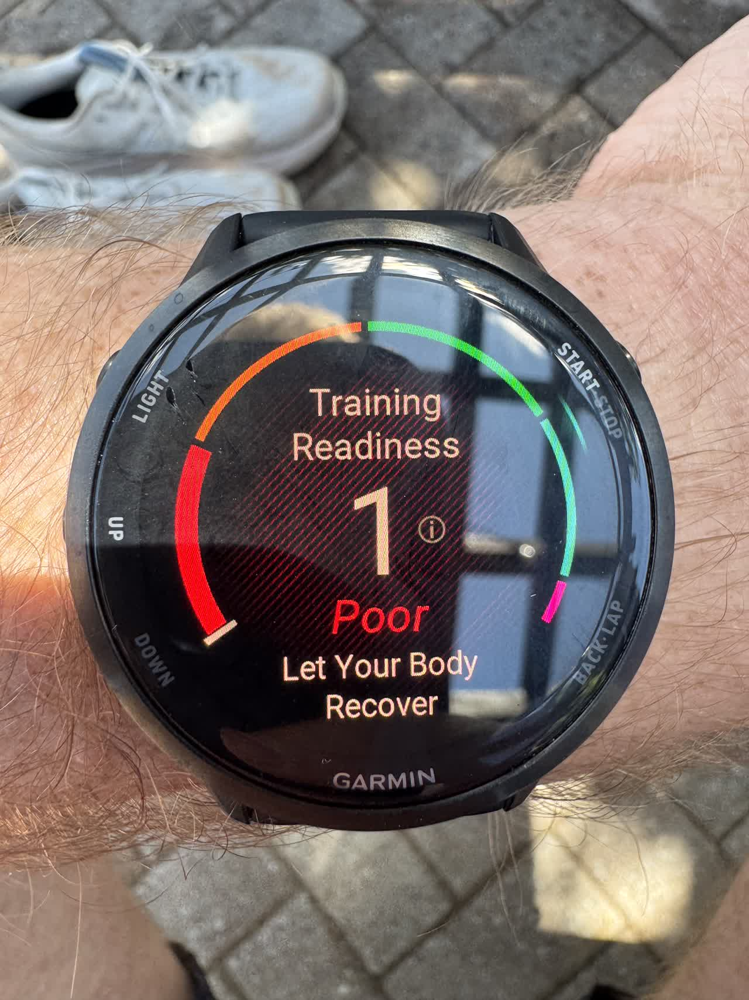
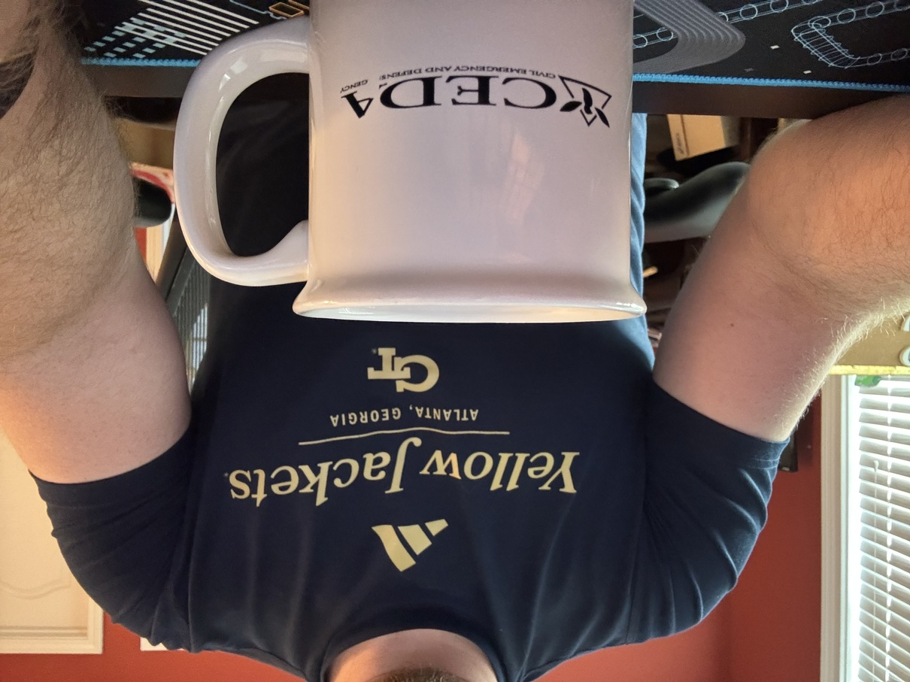
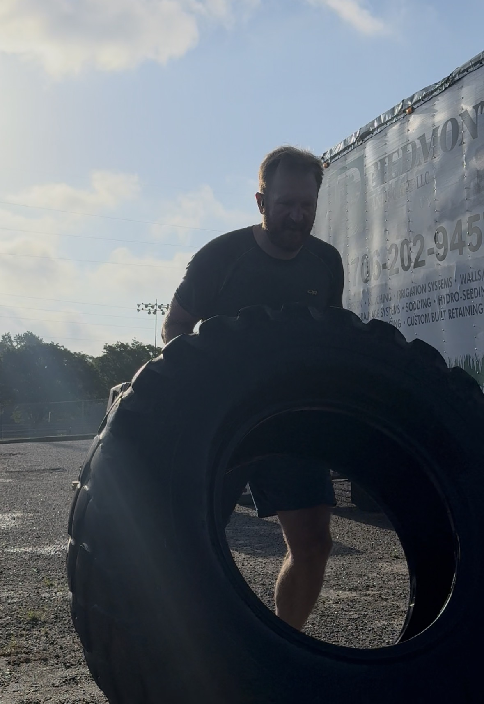
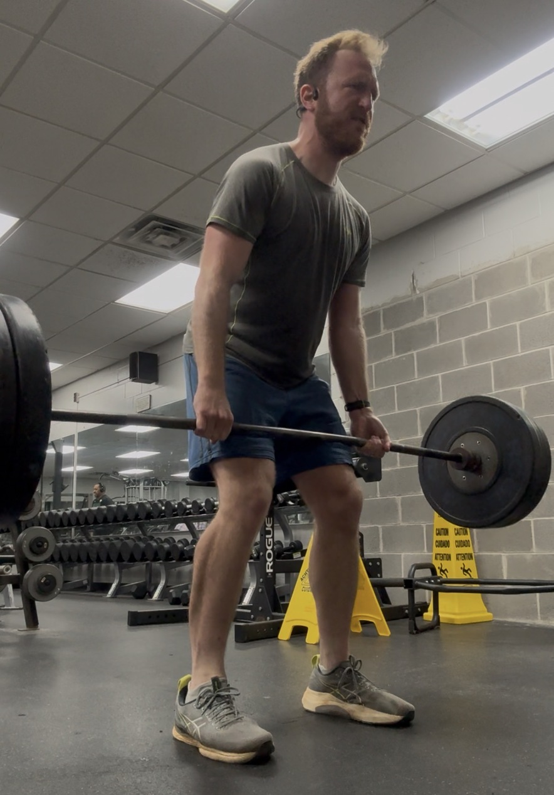
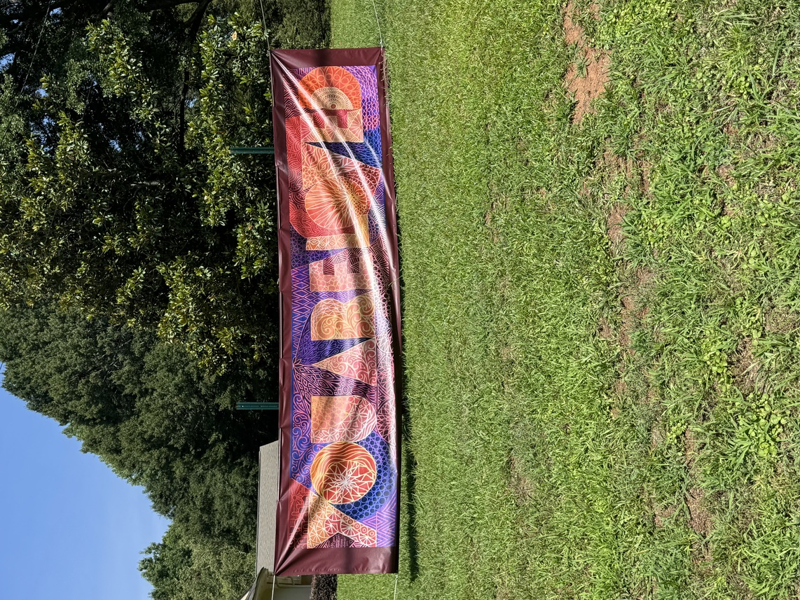
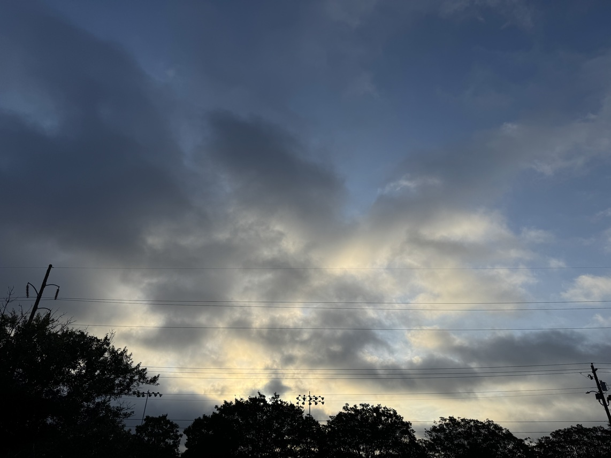

{.preview-image fig-alt="My Garmin Forerunner running watch displaying its 'Training Readiness' metric, with a giant red '1' (out of 100) score, and a 'Poor: Let your body recover' tagline underneath."}

A few weeks ago on Thursday, June 11, my team and I released version 1.0 of the software we'd been building from the ground-up since mid-October 2025.


It's an internal-only SDK so I can't go into too much detail on it, but in short: it was built to help, accelerate, and otherwise augment the workflows of other scientists at Valo. I intentionally brought an open source ethos modeled after the scientific Python community: I used all open tooling (pixi, pip and conda, Sphinx), adopted [conventional commits](https://www.conventionalcommits.org/en/v1.0.0/) and [keep a changelog](https://keepachangelog.com/en/1.0.0/) and [single source of truth](https://en.wikipedia.org/wiki/Single_source_of_truth), enforced PEP compliant coding standards, and encouraged [test-driven development](https://en.wikipedia.org/wiki/Test-driven_development). We also had a biweekly release cadence ([SemVer](https://semver.org), at least for now) that coincided with three stand-ups in each sprint, one weekly meeting with higher-ups to make sure requirements were being met, and one weekly meeting with users to either demo a new release or solicit feedback on the previous one. We included a suite of fully-worked end-to-end examples, probably a *paragraph* of documentation per line of code (I actually *tightened* the docs ahead of the 1.0 release), and my personal favorite: an entire API of custom exceptions that included intelligent feedback for users to figure out what went wrong and how to recover from it. We had CI/CD that not only ran all our tests, built our docs and compatibility matrices, and ran said examples, but also pushed the software into the highly-restricted environments of our collaborators, outright removing that _significant_ technical hurdle from our users before they ever had to begin to figure out a fix.



The single biggest compliment I received over that period of time came from my direct supervisor. Apparently, _his_ supervisor informed him that, over the course of the ~8 months of active development, this particular business case went from being a "weekly high priority concern" to something they barely needed to discuss anymore other than to pass on my regular progress updates.

The software isn't perfect, by any measure. Frankly, there are more questions now than when we started! There are still some known issues, an entire API surface we're going to deprecate over the next several minor versions, and I have enough "post-1.0" high-effort design specifications to *essentially fill out the entire roadmap to a 2.0 release*^[Some estimates have already pegged the developer hours at 500+ to implement this roadmap. So, *months*.].

I think my favorite part(s) of the entire development cycle was the accidental way in which I surfaced multiple subtle-but-related-and-showstopping bugs. At least twice (there may have been a third; I just don't explicitly recall it now), I was working on a release-day Jupyter notebook to demo the newest features. In both cases, when it came time to test the notebook---since the notebooks lived in a separate, demo repo that I, being *very silly*, had not (yet) wired into a pixi setup---rather than do things *correctly* and create said pixi environment, or even activate a conda environment, I instead invoked the conda Python executable via an absolute path, like this:

```bash
$> /path/to/conda/bin/jupyter notebook release_demo.ipynb
```

This is silly for *a lot of very good reasons*, but: in doing so, I triggered failure conditions for certain poorly-built parts of the package's backend communication with an external server. The immediate cause of failure was (of course) me using conda environments in ways they were never supposed to be used, but in both cases I surfaced very brittle and poorly-abstracted client-server negotiation, leading to some of the best hardening and future-proofing work that I think I've done.

I'm so, so freaking proud of it. Of us. Of *me*. It went from high-priority concept in September 2025 to a stable 1.0 release in June 2026.

 to design for the core of the project, and then update for the 1.0 release. I think it's pretty awesome! Go check out his stuff, he's incredibly talented.](logo.png)

### Beyond the technical

I took the entire week after the release off from work for a staycation. We'd been in nose-to-grindstone mode for basically three straight months, ever since an on-site in March where we spelled out the roadmap-to-1.0. So I figured some time off---no travel, no specific reason, just time off to rest and recover---was warranted. All the better with which to do the uncomfortable thing and sit with the accomplishment for a bit, rather than immediately moving the goalpost to the next big milestone.

::: {.callout-warning}
## Content warning: language, mostly

There's gonna be some spicy language in the following section. If you're not ok with that, that's totally fine, but you may want to stop reading here.

:::

It's hard to believe I'm solidly in the midpoint of my professional career; in a lot of ways, I feel like I've barely started. The transition from academia to industry certainly has a lot to do with that, but in some ways, academic productivity^[*Visible* academic productivity, for sure.] is^[Sorry, _was_.] slow enough that it could feel as though I wasn't progressing very quickly.

An honest assessment, though, underscores a lot of highlights, a *lot* of lowlights, and lot of friction moving from one to the other and back again. Many of these lowlights *and* highlights were invisible from all but the closest collaborators, friends, and family. Another perpetual source of anxiety: it's hard to express to external reviewers, or especially *people outside academia altogether*, the kind of absolutely necessary work that was always happening but which was largely invisible.



I've had my share of both fuck-ups and fuck-yeahs---with plenty more of both to come, I'm sure---but I have to stop and acknowledge that my brain is *really* fucking good at skipping right off the latter and focusing exclusively on the former.

Which is why I want to sit with this accomplishment: I haven't even been at Valo for a year yet (next month!), but I've already got this feather in my cap and it's *so fucking awesome*.



And, perhaps as another cake entirely rather than mere icing, I want to soak this up in the context of my Valo annual review from this past January/February. It was the first annual review I've ever had in industry, and it was the first annual review _ever_ to provide concrete feedback that I could actually act on^[A perennial problem with feedback in academia---annual reviews, paper reviews, grant feedback, you name it---is that it _always_ arrives too late to do anything about.].

But what blew me away more than anything: the annual review looked at the _how_, in addition to the _what_...and rewarded me for it. Here are some of the key excerpts:

> Shannon led with curiosity and empathy

> Through leaning into curiosity and empathy, 

> He is focused on usability of the tools, and leads through empathy, enthusiasm, and transparency.

These particular quotes have been sticking in my brain ever since I received the review earlier this year. Not just because they _actually reflect how I perceive myself_^[This has been a low-key constant struggle in previous positions, and my brain just happens to be wired in such a way that I'm easily gaslit in this area. Not a great combination when you're at the ass-end of a post-capitalist hellscape.], but also because it's my view that qualities like these are only going to be more important in the coming years. As the technical parts of the job seem increasingly "attributable to AI workflows" or "for sale to the most egregious of AI scraper bots"---depending on which end of the AI adoption spectrum you most closely align with---I'm trying to focus more and more on what makes _me_ uniquely good at what I do. In many ways, AI is "merely"^[I don't want to get into this whole debate here; just know that this word is _extraordinarily_ load-bearing.] accelerating trends that were already happening.



But even before AI really arrived on the scene, it was always batshit to me how little some people and some employers cared about the _how_ of productivity^[Including some people/employers I've worked for.], even (and perhaps, especially) if they _said_ it was something they valued. Invariably, it would be "extra credit", and extra credit only applied if the baseline productivity got through; and if the baseline _wasn't_ reached, these values might actually count _against_ you.

These bits of feedback are so small in the grand scheme of things. And yet, to me, they're _everything_.

Fucking wild.

 in the most recent PC Gamer edition!](jk2.jpeg)

Which really just underscores how so, so, so grateful I am for the position I've found and where I am in this moment. Who knows what will happen tomorrow? I'm too busy having fun now to worry too much about it.

Plus, THIS motherfucker is coming out later this year, and while my wife grew up playing it on N64 I was a latecomer to the series---basically started with Skyward Sword, and have played every installment to death since, though I did play _Link's Awakening_ on the OG Game Boy so there's that---I am _loving_ all the memes about "activating millennial sleeper agents" with just three musical notes.

.](oot.jpeg)

Anyway. Yeah, I know it's been a hot minute since my last update over two months ago, but I'm hoping with 1.0 in the rear mirror now, we'll all be able to take a collective breath and slow down a tad, so I can get back to [stating the obvious](https://blog.jim-nielsen.com/2026/blogging-stating-the-obvious/).

