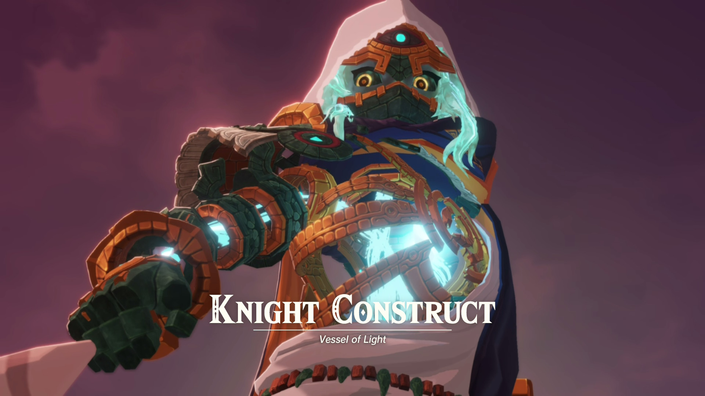
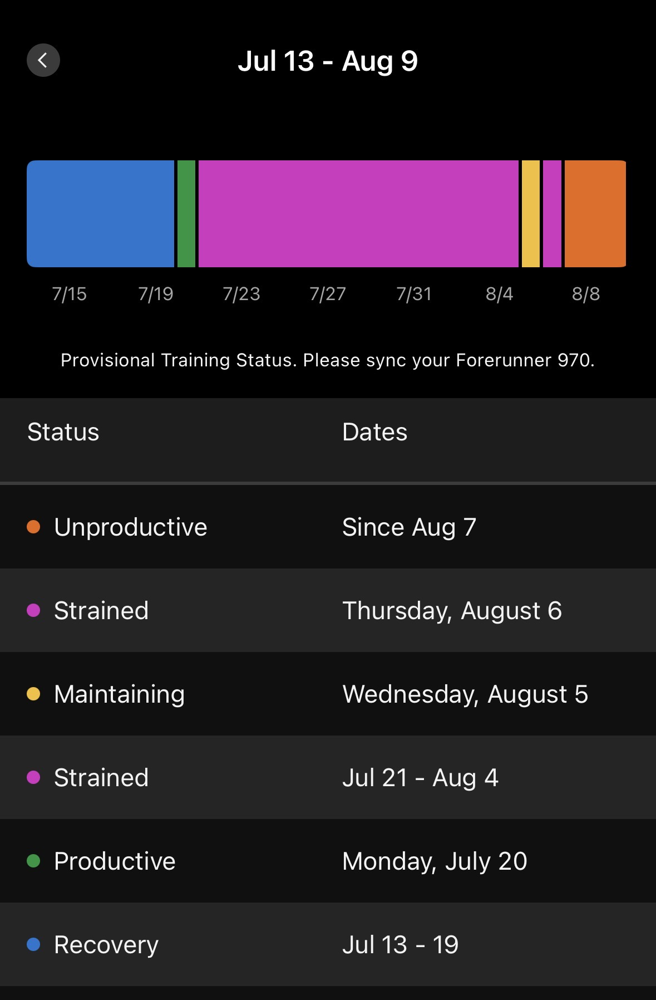
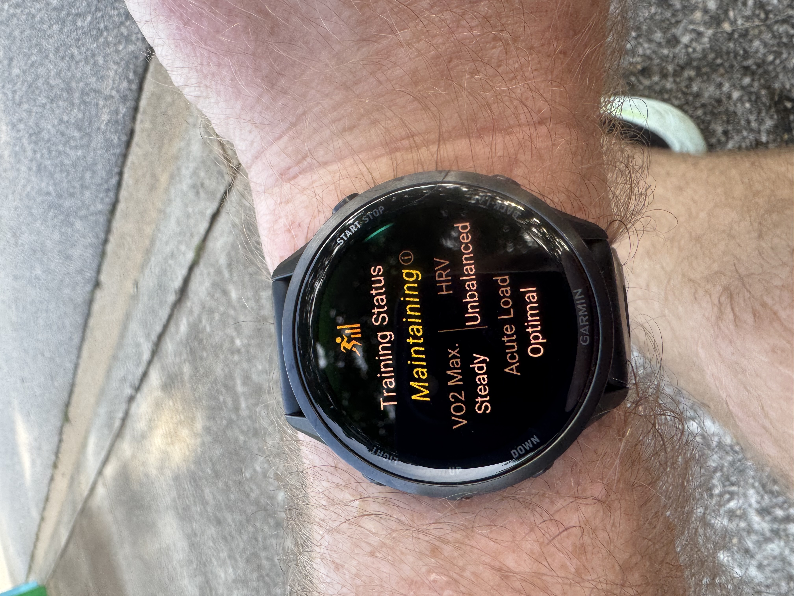
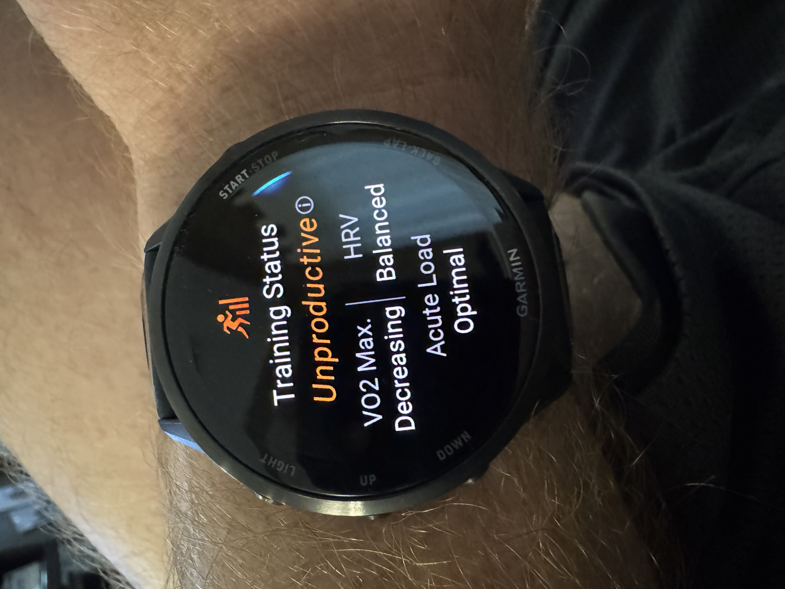
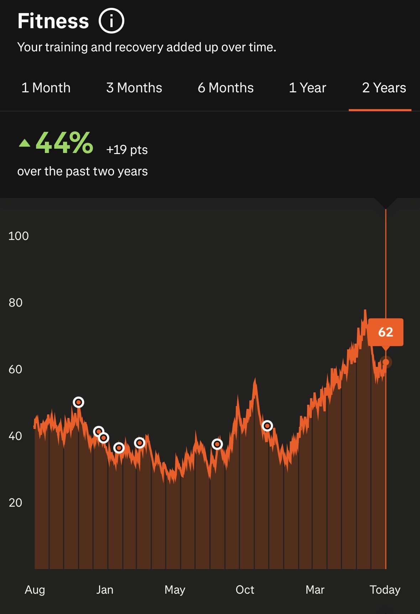
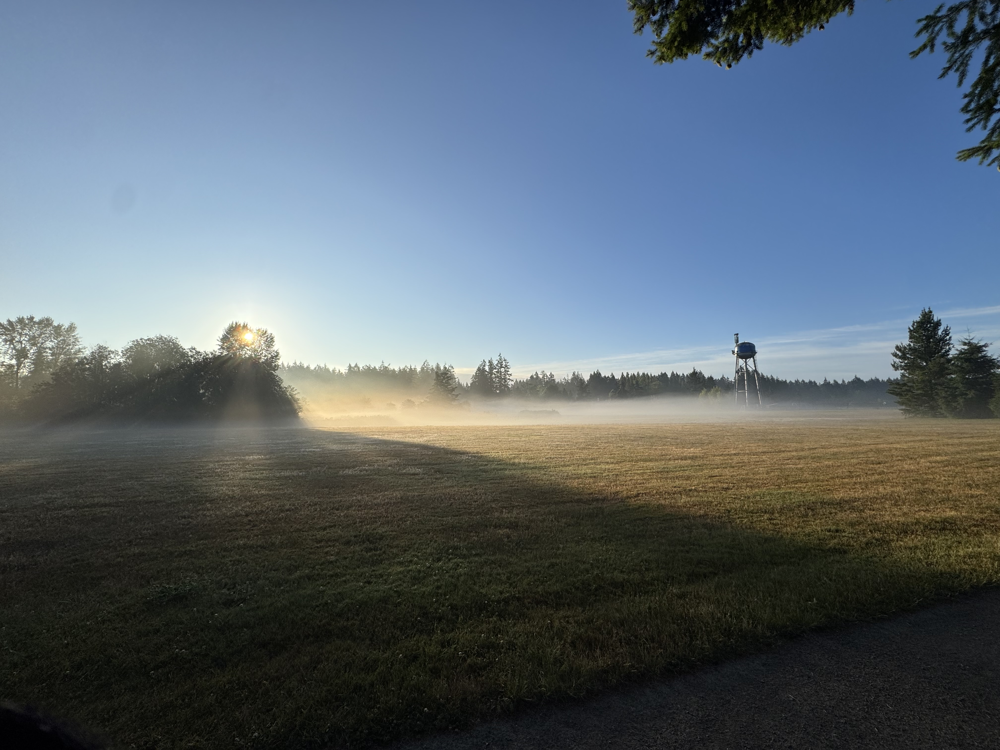

{.preview-image fig-alt="A screenshot from the pre-battle cutscene in _Age of Imprisonment_."}

::: {.callout-warning}
## Language, existential stuff

There's some language and existential angst in this post. Proceed accordingly.

:::

Are you a *Lord of the Rings* fan? Have you ever watched any of the [*In Deep Geek*](https://www.youtube.com/@InDeepGeek) videos on YouTube? If not, you are **missing out**. He goes into deep dives on everything Tolkien, plus some other fantasy worlds that I don't necessarily pay attention to, but he definitely spends the bulk of his time in Middle Earth.

One of his recent videos was on Denethor, the doomed Steward of Gondor at the time of the War of the Ring. Go watch it if you haven't seen it (and if you have 13.5 minutes to spare).



I've always loved these stories and been drawn to them: variations on "the road not taken" and, to a lesser extent, the "butterfly effect" in terms of what it would have taken to alter the person's chosen path. I've even postulated at least a handful of moments like these in my own life, where I could have made a different decision and become a wholly different person.

Of course, we've ultimately no way of knowing: whether or not our current selves are so fragile as to be completely remade by one single changed decision or event, or whether that single decision that would change us so completely was even the decision _we think_ it was, will always be unknown.

All of which got me thinking a lot about hope. After all, that's practically the singular theme of _The Lord of the Rings_ and really all of Tolkien's writing. In a world like ours where so much is utterly beyond our control---even, to a great extent, the trajectories of our own selves---"hope" is the thing that we all keep coming back to, even if it's not something we're consciously aware of.

We _hope_ the deadline at school / work goes well.

We _hope_ we're raising our kids right.

We _hope_ we'll settle into our new lives after a cross-country move.

We _hope_ pushing through that run instead of going back to sleep was the right call.

We _hope_. We always _hope_.

Even though it came out in November 2025, I'm still working my way through _Hyrule Warriors: Age of Imprisonment_. I completed the main quest line about a month ago, so now I'm in the "mopping up the remaining baddies" stage of things, and in particular really bringing it up to where _Tears of the Kingdom_ begins.

The Knight Construct is easily one of my favorite characters. I mean, he's basically just Link, but the extent to which he really is just Link is so on-the-nose that you can't help but chuckle... and also admire.

The guy literally has no concept of "despair". Like, zero. The only question he asks himself^[Because he certainly won't say it out loud, or literally anything else for that matter.] is whether something is right. If it is, he acts. That's all there is to it.

"Hope" is deeply implicit here. Even if anyone else would have said that it's a foregone conclusion that Ganondorf would win, the Knight Construct would have seen evil, knew itself to be capable of fighting evil, and would therefore go fight said evil. "Hope" as a conscious concept probably never entered its head, but it drove the entire process regardless^[Yeah yeah, Triforce of Courage, yadda yadda yadda. Courage without hope is merely two suicides in a trenchcoat.].

I mean, so complete was the Knight Construct's hope for victory that he _summoned the Master Sword itself across space and time_^[Spoilers for a 9-month old game, I guess.]:

I personally relate more to characters who actually experience despair from time to time, wavering in the execution of their duty; it's one of the (many) reasons why I love Brandon Sanderson's _Stormlight Archive_^[Kaladin annoys me the most, hands-down. Because sometimes I swear he's a carbon copy of me.]. But there's something I deeply, deeply admire about characters who simply _do not waver_ in their mission to always do what's right. Ethan Hunt from the _Mission Impossible_ movie series feels this way, too: dude just cannot stop until the evil is gone, regardless of risk, odds, or any other real or potential obstacle.

---

I can't speak for anyone else, but 2026 has not been a great year for us so far. Aside from what seems to be just the constant bombardment of daily existential crises^[Note to any and all Gen Z / Gen Alpha readers out there: _this shit is NOT normal_. Don't for one moment think that what we're currently living in is a "normal" baseline.], we haven't caught any breaks on the interpersonal front since the start of the year.

Aside from [COVID being our 2026 welcome wagon](../2026-01-03-new-years/index.qmd), extended family in particular has been an actively stressful element of our 2026 day-to-day, with no sign of letting up. In particular, Cathryn has had to travel a lot for personal reasons that I won't get into, but suffice to say it hasn't been "for fun," and the ripple effects have been substantial.

One of those, I hate to admit, has been financial. I know no one likes talking about this, while also simultaneously constantly talking about how expensive everything is (true), how wages are stagnant (true), how the AI bubble popping will probably ruin everyone's 401ks (true), and how all meaningful wealth gains are locked up by millionaires and billionaires (all true). But the individual realities that get smeared out by aggregation matter, and the reality is that 2026 has been a _brutally_ expensive year. I mean, we're extraordinarily fortunate, and we'll be fine^[Hope in its purest form these days.], but I also have to be honest in that I've never really seen numbers like these before.

Another has been our physical well-being. My Garmin watch has taken notice here: ever since returning from our two-week Seattle trip earlier this summer, my Garmin has had me in "suboptimal" training states. I'm familiar with "Unproductive" and even "Detraining", but apparently I've gone so far over the bend of late that I got to discover a new one I'd never experienced before: "Strained".

It had me as "Strained" for _two straight weeks_.

Now, I've put a lot of work into honing and trusting my own instincts when it comes to my physical well-being; that's a work in progress, but I'll always take how I'm feeling over what a wearable tells me. That said, I will consider the wearable as additional evidence. For example: if I'm feeling extremely borderline, and my watch says my sleep was shit and my body isn't recovering, I'll that into consideration and likely nix a workout (and replace it with an easy outing or something).

And chat, let me tell you: I've been _fucking exhausted_ these past handful of weeks. Yeah, it's been annoying to be stuck in this bullshit training status I've never even seen before, but frankly it's accurate.

Which is why I practically lept out of my skin and danced on my driveway after returning from a run recently and seeing this:

Of course, as you saw in the previous app screenshot, that status didn't last but for a single day before reverting back to "Strained", and then a day later to a much more familiar but no less reviled "Unproductive."

Sleep quality has been on-and-off, reminiscent of the worst of the tenure-track process back in 2017-2018. I'm pretty thrilled to be able to say that it's _not_ work-related sleep loss this time, so that's absolutely a huge positive. But sleep loss is still sleep loss, regardless of the cause: it makes everything else harder to handle.

---

And yet, if Strava is to be believed, I'm actually in the best shape of the past two years (and most likely the best shape of my life post-2020).

After me spending 2/3 of a blog post talking about how difficult 2026 has been, this graph paints a very complicated picture: I've spent all of 2026 _getting stronger_, at least from a physical standpoint (and via what Garmin and Strava can measure from their _extremely limited sensors and circumstantial evidence_).

This graph was doubly surprising because I've spent so many weeks kind of ragging on myself, as I have yet to log a single week in 2026 where I hit all my lifting AND running workouts; something has inevitably been dropped in every week of the year so far. And yet, this graph!

I don't want to call it "optimism" because I associate that with "having a plan", and often---like pretty much all of this year so far---I either don't have a plan or the one I do have crumbles to dust within the first couple steps of execution. I also won't directly call it "hope", because that's certainly not what's been on my (conscious) mind. But why else would I keep getting runs in on weeks where the plan has fallen apart by Wednesday? Why else would I keep going to the gym despite missing entire weeks (and why would my trainer continue to excitedly welcome me back)?

Why else would I keep parenting when it seems like the world kiddo is poised to inherit is burning?

Why else would I jump ship from a job that sucked out my soul, but the contours of which I had a deep understanding of and even _liked_ many aspects of?

Why else would I invest in new and existing friendships after a couple of friends I considered among my closest made it clear they were done?

Why else would I keep teaching myself new things when it seems like the explicit promise of "AI" is to replace human intelligence?

I think a significant nonzero part of the answer here may simply be: because I don't know how to quit. I truly don't. It's why I struggle so hard with burnout: I'll spin my wheels for far too long in situations that _scream_ for me to walk away.

But I'd also like to think that the other part of the answer is the Gandalfs and Knight Constructs we met along the way.

