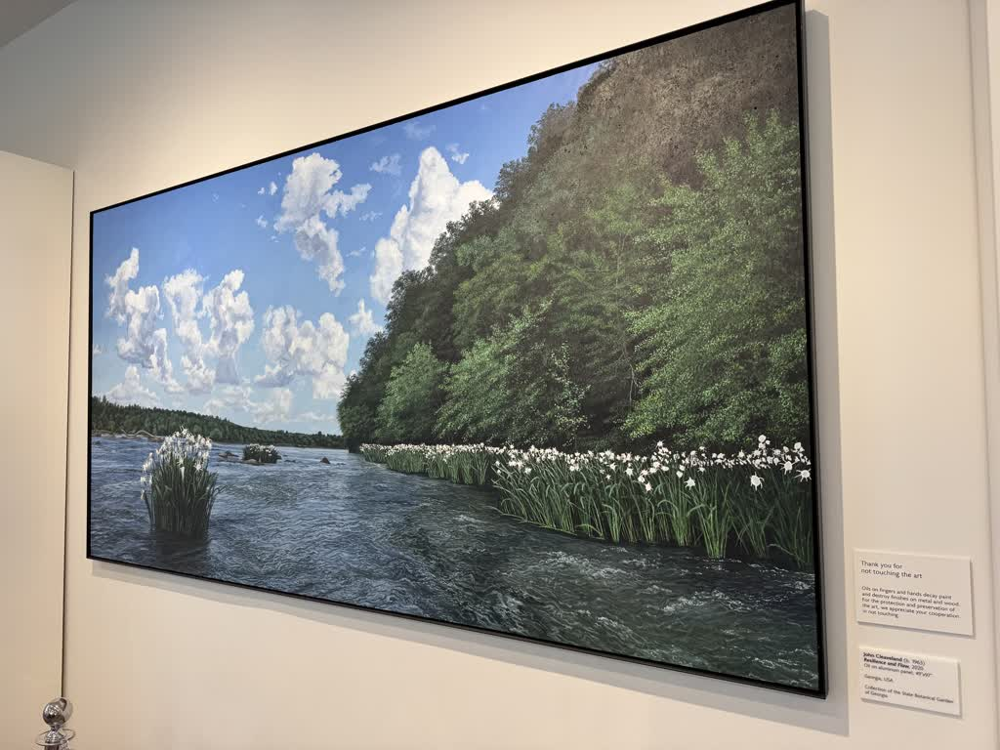
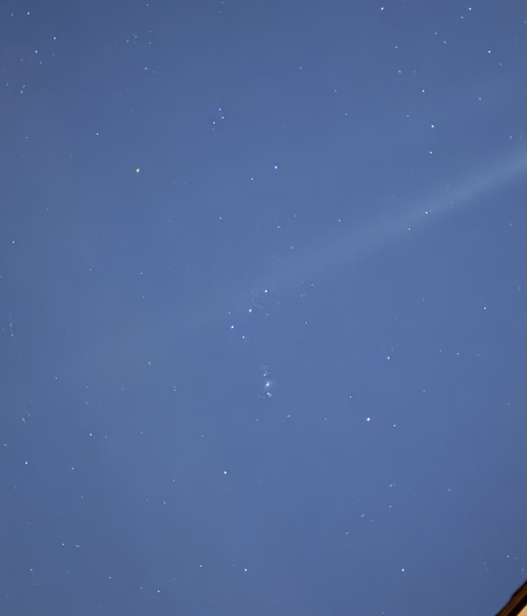
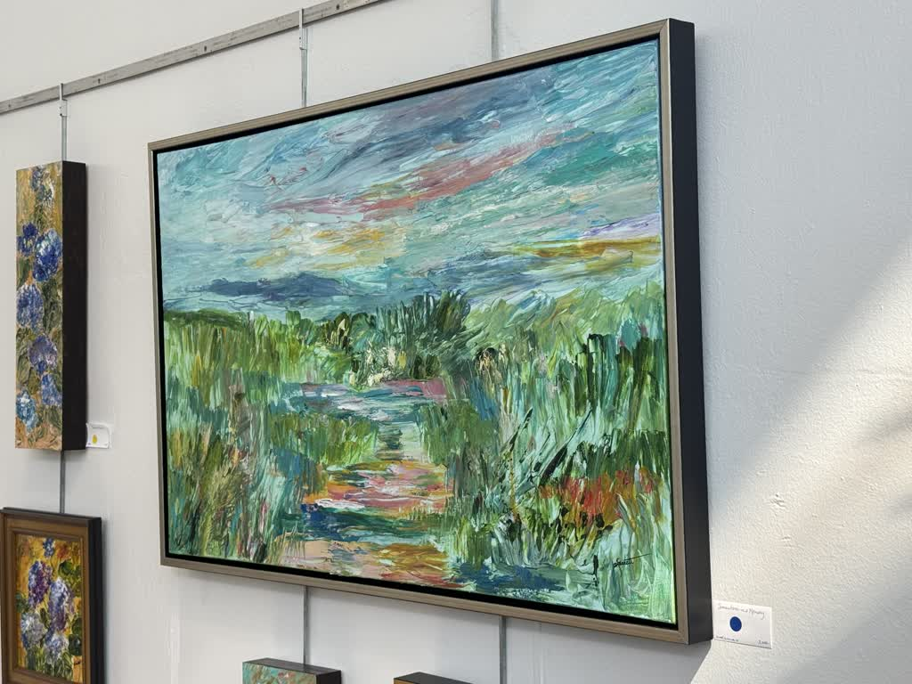
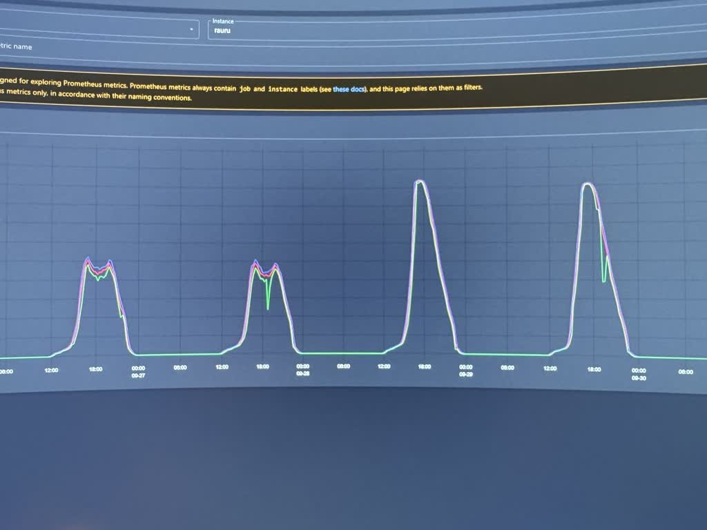
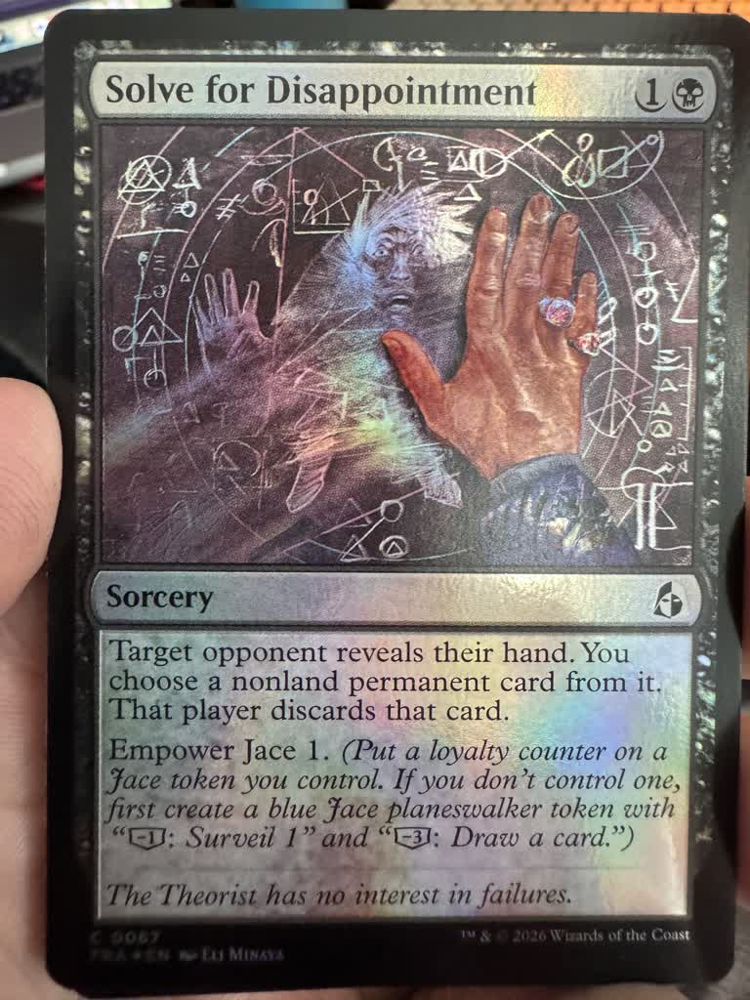

{.preview-image fig-alt="Oil-on-canvas painting of a riverbed with lots of greenery both in and out of the water, hanging on the wall at the local Botanical Gardens."}

I've spent the better part of the past month working on not just one, but *two* posts inspired by recent conversations I've had about AI with friends and family. There's a ton of information I'm trying to distill: my own experiences using AI chatbots, breaking down recent news headlines, separating hype from reality, and also trying to convey the things I'm *actually* worried about.

But I'm just too fucking tired to finish them right now. They're like 80% done, but are also in desperate need of an editing pass (or several), and I have [negative spoons](https://en.wikipedia.org/wiki/Spoon_theory).

The consequences of not using AI to write my posts, am i rite?

Honestly I've been struggling to find a routine again after the most recent work travel. My body is clearly trying to recover, and I keep misreading the room and doing things like "most intense lifting workout in weeks" and "longest run in months" when I really probably need to ease off the gas just a bit longer.

Anyway. Please enjoy some recent photos from my recent goings-on. I'll get those posts up soon, I promise.

