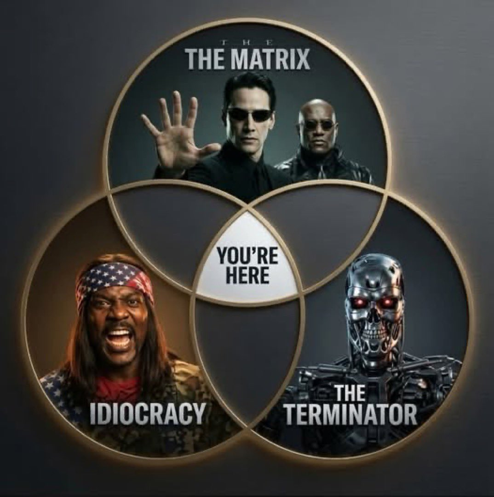

{.preview-image fig-alt="A recent moonrise throwing out J.J. Abrams-magnitude lens flares."}

Alright, here we go: part 2 of 2.

::: {.callout-warning}
## Recent AI headlines

In the second post, I'm going to discuss some recent AI-related news headlines that people have asked me for my take on. These are not light discussions, and honestly it's weighing on me too, but I think it's worthwhile to bring up; suffice to say, if you'd rather not, then don't. I won't take offense.

:::

## "AI Apocalypse", aka p(doom)

https://youtu.be/KSXm_KCMR60?si=ZSvmPele2d_wI_xO

"Centralization of human power"

All these "effective altruists" would, I think, unironically agree with Director Pierce's vision of the world from *Captain America: Winter Soldier*: "I can bring peace to 8 billion people by sacrificing a few million."

https://yoshuabengio.org/en/blog/why-are-ai-agents-lying-cheating-and-coordinating

Slightly more interesting technical details, much less interesting mitigation suggestions other than to "do better; by the way here's a thing I sponsor that I think would be great." 

I'm kind of fed up with these "Godfathers of AI" to be honest.

https://gist.github.com/bg50/23bdbf4f7032024c71d7585e53a4be69

> \[This\] is a failure of specification and containment, the oldest failure 
> mode in computing, running for the first time on something that can improvise.

https://www.nytimes.com/2026/09/04/podcasts/hugging-face-hack-reports.html

*The Hard Fork* podcast by the New York Times. Recommended to me by a friend. This has an actual expert on AI safety walk through things. Can get a bit overly alarmist, but lands at pretty much the same point as me: I'm less worried about these AI systems than I am about the people designing, building, and training them. It's the "data scientist" mindset of the early-to-mid 2010s run amok: "I know enough about machine learning to be dangerous, so now I'm going to stick my know-how in areas it *really doesn't belong* but do so with absolute confidence not only that I'm right, but that I'm the *only* person who can be trusted to do this."

I'm both blessed and cursed to have a deep technical understanding of how these chatbots are built, trained, and put into production. Blessed, because I legitimately think the actual underlying technologies are *cool as hell*^[While I was at UGA, I *loved* lecturing about [Transformers](https://en.wikipedia.org/wiki/Transformer_(deep_learning)), the core technology underlying modern chatbots. I loved it not only because Transformers are legitimately cool, but also because they built on an incredibly rich history of similarly amazing theoretical and technological advancements that were absolutely necessary to enabling Transformers.]. Cursed, because I know that

 1. these chatbots aren't human, no matter how much they sound human; and
 2. randomness is built in at a fundamental level

These chatbots are *not deterministic*: identical input will NOT give you identical output. They don't "think" or "reason", at least not the way humans do, and so their output is not something we can dissect and try to understand in human terms. People have said it pithier than me, but essentially: what chatbots output is not THE answer, but rather AN answer that *statistically* "sounds like" THE answer. Sometimes those two things overlap, but they do not *necessarily* overlap.

In sum: modern chatbots are designed to output something that statistically resembles an answer to whatever input I initially provided. Not only does that very explicitly NOT guarantee the output is correct, but even the underlying process by which the chatbots arrive at this "statistically plausible output" is fraught with more statistically-plausible justifications that may or may not reflect reality.

https://gamersnexus.net/news-features/memory-companies-have-destroyed-consumer-market